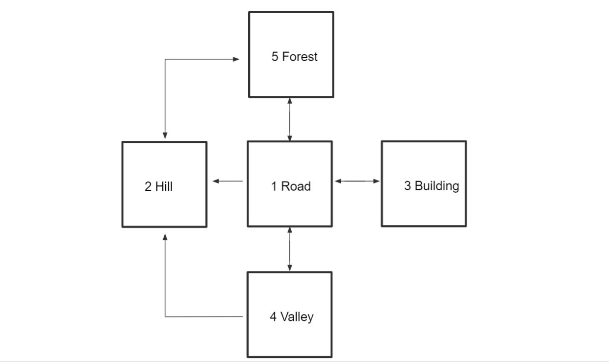

# Adventure Game
The repository that you clone contains a simple Maven project with two classes: `Location.java` and `Driver.java`.

> Upon cloning the repo make sure you run `mvn clean install` within the root directory.

Currently the user is able to run `Driver`and it opens up a simple console-driven program that emulates the original [*Colossal Cave Adventure Game*](https://en.wikipedia.org/wiki/Colossal_Cave_Adventure).  There are 5 rooms, each with their respective exits which the user can navigate through.  

Below is a diagram of the Game Map:

 

## Challenge
Convert the existing project to a **Spring Application** complete with an api layer that allows the user to send get/post requests and recieve their updated location in the body of the HTTP response.

Hints:
- Create a sepearate model called `ClientMessage.java` which has a `message` and `locationId`.
  - The `message` represents the instructions the client would send to the server.  Previously this was just what the user would enter in the console, such as "go south" .
  - The `locationId` represents the room number of the **current room the user wants to move *from***.

- Create a separate package called `com.revature.controller`. This is where you would create your `InputController.java` class.
  - Annotate this class with the `@Controller` annotation.  You could also use the `@RestController` annotation. [Here's a resource on the differences](https://www.baeldung.com/spring-controller-vs-restcontroller).  
